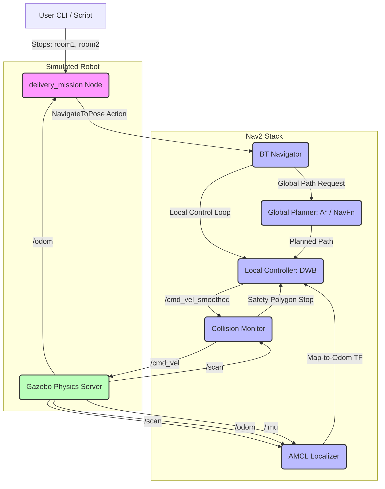

# Technical Report: Autonomous Indoor Delivery Robot Simulation
### Course Project Presentation & System Architecture Document
**Authors:** Bethel, Esrom, Yanit  
**Department:** Artificial Intelligence (AAIT)  
**Platform:** ROS 2 Humble · Gazebo Classic 11 · Nav2 · slam_toolbox

---

## 1. Executive Summary

This report presents a fully autonomous indoor delivery robot system designed to operate within a simulated multi-room office environment. Using **Robot Operating System 2 (ROS 2) Humble**, the system integrates a custom differential-drive robot model, real-time Simultaneous Localization and Mapping (SLAM), adaptive localization, path planning, obstacle avoidance, and high-level mission orchestration.

The workflow operates in two distinct phases:
1. **Mapping Phase (SLAM):** An automated exploration node (`slam_explorer`) commands the robot to traverse the environment, constructing a metric occupancy grid map via `slam_toolbox`.
2. **Navigation Phase:** The map is frozen, and a high-level mission orchestrator (`delivery_mission`) sequences multi-stop delivery routes. The robot localizes using Adaptive Monte Carlo Localization (AMCL) and plans trajectories using an A* global planner and a Dynamic Window Approach (DWB) local controller, monitored by a safety-critical collision polygon observer.

---

## 2. System Architecture

The robot's software architecture follows a modular, node-based layout. High-level commands flow from the mission CLI to the navigation stack, which translates them into physical velocities for the Gazebo simulator.



---

## 3. Robot URDF Model Design & Kinematics

The physical chassis is defined as a differential-drive robot using Unified Robot Description Format (URDF) extended with Xacro macros.

### 3.1 Kinematics & Inertial Properties
*   **Chassis Geometry:** Cylindrical shape (Radius: 0.25 m, Height: 0.15 m, Mass: 5.0 kg) ensuring isotropic rotation inside tight spaces.
*   **Actuation:** Two actuated side wheels (Radius: 0.08 m, Width: 0.04 m, Mass: 0.5 kg) driven by the Gazebo diff-drive controller plugin.
*   **Stability Calibration:** To resolve caster-induced tipping, the passive caster wheel (Radius: 0.03 m) joint geometry was mathematically matched to the drive wheel radius:
    $$\text{Caster } Z_{\text{origin}} = - \left( \frac{\text{Base Height}}{2} \right) - \text{Wheel Radius} + \text{Caster Radius}$$
    This offsets the base link exactly $0.08\text{ m}$ off the ground, ensuring perfectly horizontal weight distribution.

### 3.2 Sensor Configurations
*   **LIDAR (Laser Range Finder):** Emulates a 360-degree planar scanner operating at 10 Hz with 360 samples, a range of 0.12 m to 10.0 m, and Gaussian noise ($\sigma = 0.01\text{ m}$).
*   **IMU (Inertial Measurement Unit):** Measures angular velocity and linear acceleration along three axes to aid localization.

---

## 4. Coordinate Frames & Transformations (TF2)

The system relies on the standard ROS spatial transform chain to navigate within the Cartesian coordinates of the occupancy map.

```
map (World Origin)
 └─ odom (Odometric Accumulation - drifts over time)
     └─ base_footprint (Projection of robot center on ground plane)
         └─ base_link (Robot physical chassis origin)
             ├─ left_wheel_link
             ├─ right_wheel_link
             ├─ caster_link
             ├─ laser_link (LIDAR scanner focal point)
             └─ imu_link (IMU sensor center)
```

*   **`map` $\rightarrow$ `odom`:** Published by AMCL. Corrects for cumulative wheel slip and odometry drift by comparing LIDAR observations to the static map.
*   **`odom` $\rightarrow$ `base_footprint`:** Published by the Gazebo differential drive plugin based on wheel encoder integration.
*   **`base_footprint` $\rightarrow$ `base_link` $\rightarrow$ sensor links:** Static transforms defined in the URDF file.

---

## 5. SLAM & Automated Exploration

The Simultaneous Localization and Mapping phase uses `slam_toolbox` in `online_async` mode to map the unknown world.

### 5.1 slam_toolbox Parameter Architecture
*   **Scan Matcher:** Utilizes Ceres Solver for scan-to-scan matching, optimizing local position updates.
*   **Loop Closure:** Scans the historical trajectory for spatial overlaps. When a loop is detected, a global pose-graph optimization executes to resolve cumulative drift.

### 5.2 Automated Mapping Node (`slam_explorer`)
To bypass slow, error-prone keyboard teleoperation, a custom ROS 2 python node, `slam_explorer`, was developed. It uses timed open-loop cmd_vel trajectories with localized sweeps:
*   **Sweeping Action:** Rotates the LIDAR $\pm 30^\circ$ at key points to build a full field of view inside rooms.
*   **Path Routing:**
    ```
    Base (Sweep) ──> Room 1 (Sweep) ──> Room 2 (Sweep) 
                      │
                      └──> North to Room 4 (Sweep) ──> West to Room 3 (Sweep) ──> Base (Return)
    ```

---

## 6. Nav2 Navigation Pipeline

Once the map is generated and saved (`office_map.pgm` and `office_map.yaml`), the Nav2 stack controls the autonomous movement.

| Nav2 Module | Algorithm / Configuration | Purpose |
|---|---|---|
| **Map Server** | Trinary Occupancy Grid Loader | Feeds the map image to Nav2 servers. |
| **AMCL** | KLD-Sampling Monte Carlo localization | Tracks robot position inside the map using particles. |
| **Global Planner** | A* (NavFn) | Finds the shortest collision-free grid path. |
| **Local Controller** | DWB (Dynamic Window Approach) | Computes real-time velocities ($v, \omega$) to track the global path. |
| **Collision Monitor** | Polygon Safety Monitor | Cuts power if an obstacle breaks the footprint envelope. |
| **Lifecycle Manager** | Sequenced Startup Orchestrator | Controls transitioning nodes through active/inactive states. |

### 6.1 Collision Avoidance & Recovery Behavior
The local controller evaluates trajectories over a short forward horizon. To prevent collisions with the patrolling dynamic obstacle:
1. **DWB Critics:** Path alignment, goal alignment, and obstacle distance scoring are weighted to prioritize clearing obstacles.
2. **Collision Monitor (PolygonStop):** A safety-critical polygon box ($0.6\text{ m} \times 0.44\text{ m}$) centered on the robot base monitors the `/scan` topic. If $\ge 4$ laser points fall within the polygon, the collision monitor intercepts the `/cmd_vel` output and publishes zero velocity to prevent collision.
3. **Recovery Behaviors:** If stuck, the Nav2 behavior tree initiates recovery procedures: clear costmaps $\rightarrow$ spin in place $\rightarrow$ back up $\rightarrow$ retry path planning.

---

## 7. Custom Python Utilities & Mission Node

```
┌────────────────────────────────────────────────────────────────────────┐
│                        DELIVERY SYSTEM SUITE                           │
├────────────────────────────────────────────────────────────────────────┤
│ 1. health_check.py      --> Pre-flight topic & action server validator  │
│ 2. record_waypoints.py  --> Interactive mapping tool for Room Posets   │
│ 3. delivery_mission.py  --> Main mission action client orchestrator     │
└────────────────────────────────────────────────────────────────────────┘
```

### 7.1 Pre-Flight Health Validator (`health_check`)
Verifies system sanity before launching missions:
*   Checks existence and active message publication on `/scan`, `/odom`, `/map`, and `/amcl_pose`.
*   Pings the `navigate_to_pose` Action Server to ensure the Nav2 stack is fully transition-activated.

### 7.2 Waypoint Recorder (`record_waypoints`)
Operators drive the robot to each room post-mapping. The script reads `/amcl_pose` (or `/odom`), extracts the current Cartesian position and orientation, and formats the output into a dictionary ready to paste directly into the mission file.

### 7.3 Delivery Orchestrator (`delivery_mission`)
An Action Client that sends `NavigateToPose` goals to the Nav2 Action Server. Key features:
*   **Multi-Stop Routing:** Sequences multiple destinations (e.g. `room1 room3 room2`).
*   **Fault Recovery:** If navigation to any stop fails or times out (120 s limit), the node initiates an **emergency return to base** to secure the payload.
*   **Loop Option:** Run with `--loop` to repeat delivery routes continuously.

---

## 8. Deployment & Execution Guide

### 8.1 Build the Workspace
```bash
cd ~/ros2_ws
colcon build --symlink-install
source install/setup.bash
```

### 8.2 Run Autonomous SLAM Mapping
```bash
# Terminal 1: Launch Gazebo world, robot URDF, SLAM toolbox and RViz
ros2 launch delivery_robot slam_launch.py

# Terminal 2: Run the automated mapping explorer
ros2 run delivery_robot slam_explorer

# Terminal 3: Once mapping is complete, freeze the map
ros2 run nav2_map_server map_saver_cli -f ~/ros2_ws/src/Robotics/delivery_robot2/delivery_robot/maps/office_map
```

### 8.3 Run Autonomous Delivery Mission
```bash
# Terminal 1: Launch Navigation Mode (loads the frozen map)
ros2 launch navigation_launch.py

# Terminal 2: Run health check to confirm stack readiness
ros2 run delivery_robot health_check

# Terminal 3: Dispatch robot to Room 1, Room 3, and Room 2
ros2 run delivery_robot delivery_mission room1 room3 room2
```

---

## 9. Key Performance Tuning Decisions
*   **Modular Launch Refinement:** Replaced the monolithic `nav2_bringup` launch with individual node instantiations in `navigation_launch.py`. This resolves timing races during initialization by delaying Nav2 activation until Gazebo physics are fully initialized.
*   **Caster Height Alignment:** Solved physical wheel-wobble and tipping in Gazebo by lowering the caster attachment origin by $0.05\text{ m}$, aligning it perfectly with the drive wheel contact plane.
*   **Local Costmap Inflation:** Adjusted inflation radius parameters to allow the robot to fit through the narrow doors of the office layout without triggering costmap collisions.
