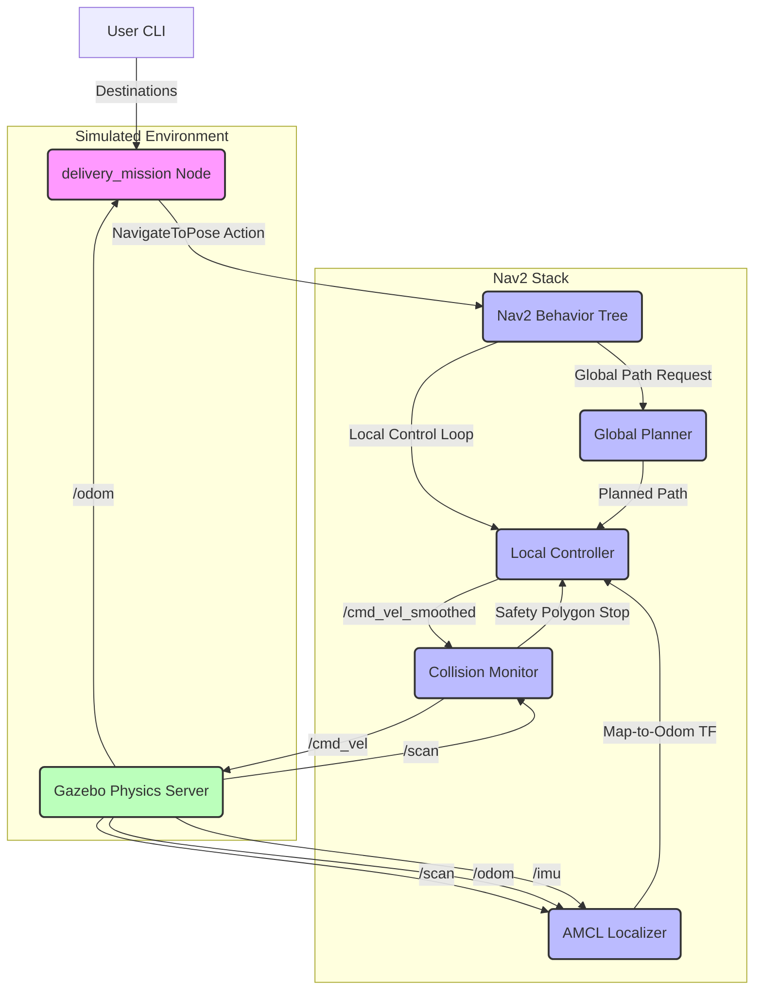

# Technical Report: Autonomous Indoor Delivery Robot Simulation
### Course Project Presentation & System Architecture Document
**Authors:** Bethel, Esrom, Yanit  
**Department:** Artificial Intelligence (AAIT)  
**Platform:** ROS 2 Humble · Gazebo Classic 11 · Nav2 · slam_toolbox

---

## 1. Executive Summary

This report outlines the design, architecture, and technical implementation of an autonomous indoor delivery robot. The system operates in a simulated multi-room office environment built in **Gazebo Classic 11** and is driven by **ROS 2 Humble**. The project demonstrates a complete autonomous navigation pipeline: from zero-knowledge environment exploration (SLAM) to dynamic routing, local obstacle avoidance, and mission orchestration.

The system is designed to handle realistic challenges such as dynamic obstacles (office workers), tight corridors, and sensor noise, leveraging industry-standard algorithms configured for dual-mode comparison (DWA vs. MPPI).

---

## 2. Project and Folder Structure

A modular package structure ensures separation of concerns between physics modeling, navigation configurations, and high-level mission logic.

```text
delivery_robot/
├── delivery_robot/              # Core Python Nodes
│   ├── delivery_mission.py      # Mission orchestrator (Action Client & State Machine)
│   ├── dynamic_obstacles.py     # Real-time Gazebo entity controller for moving obstacles
│   ├── metrics_logger.py        # Performance logging (duration, path length, recovery events)
│   ├── record_waypoints.py      # Interactive tool to map physical coordinates to room names
│   └── health_check.py          # Pre-flight system validator
│
├── config/                      # Parameter Definitions
│   ├── nav2_params_dwa.yaml     # Algorithm Set 1: A* Global + DWB Local
│   ├── nav2_params_mppi.yaml    # Algorithm Set 2: Smac Hybrid A* Global + MPPI Local
│   └── slam_params.yaml         # slam_toolbox configuration for mapping
│
├── launch/                      # System Orchestration
│   ├── slam_launch.py           # Phase 1: Bootstraps Gazebo, URDF, and SLAM
│   └── navigation_launch.py     # Phase 2: Bootstraps Nav2 stack, AMCL, and Dynamic Obstacles
│
├── urdf/                        # Robot Physics & Kinematics
│   └── robot.urdf.xacro         # Xacro macros defining chassis, diff-drive, LIDAR, and IMU
│
├── worlds/                      # Gazebo Environments
│   └── office.world             # 4-room office with furniture and dynamic entity definitions
│
├── maps/                        # Persistence
│   └── office_map.yaml          # Saved occupancy grid metadata (points to .pgm image)
│
└── rviz/                        # Visualization
    ├── slam.rviz                # Visualization profile for mapping phase
    └── navigation.rviz          # Visualization profile for autonomous delivery phase
```

---

## 3. Full System Workflow

The project is structured into two distinct operational phases:

### Phase 1: Mapping & Exploration (SLAM)
1. **Bootstrapping:** The environment is loaded into Gazebo alongside the physical robot model.
2. **Exploration:** The `slam_explorer` (or manual teleop) drives the robot through unknown spaces.
3. **Map Construction:** `slam_toolbox` actively fuses LIDAR (`/scan`) and wheel odometry (`/odom`)This structural approach will immediately address the data quality issues and algorithmic bottlenecks holding back your current metrics. to construct a 2D occupancy grid in real time.
4. **Serialization:** The completed map is frozen and saved to disk using the `map_saver_cli` as an image (`.pgm`) and metadata file (`.yaml`).

### Phase 2: Autonomous Delivery & Navigation
1. **Localization:** The `map_server` loads the static map, while AMCL uses a particle filter to track the robot's pose relative to the map origin.
2. **Pre-flight Checks:** The `health_check.py` node verifies that all critical sensor streams and the Nav2 action server are active.
3. **Mission Dispatch:** The user initiates a delivery via the CLI (`ros2 run delivery_robot delivery_mission room1 room2`).
4. **Execution:** 
   - The mission node coordinates stops, loading times, and payload status (visualized as a green box in RViz).
   - The Nav2 Behavior Tree orchestrates global path planning, local velocity commands, and recovery behaviors if stuck.
   - Dynamic obstacles actively cross the robot's path, forcing the local planner to execute evasive maneuvers.
5. **Metrics Logging:** `metrics_logger.py` records the time taken, distance traveled, and recovery actions to a CSV for performance evaluation.

---

## 4. System Architecture & Component Interactions


```mermaid
graph TD
    classDef client fill:#f9f,stroke:#333,stroke-width:2px;
    classDef nav fill:#bbf,stroke:#333,stroke-width:2px;
    classDef sim fill:#bfb,stroke:#333,stroke-width:2px;

    User[User CLI] -->|Destinations| DM(delivery_mission Node):::client
    DM -->|NavigateToPose Action| BT(Nav2 Behavior Tree):::nav
    
    subgraph Nav2 Stack
        BT -->|Global Path Request| GP(Global Planner):::nav
        BT -->|Local Control Loop| LP(Local Controller):::nav
        GP -->|Planned Path| LP
        AMCL(AMCL Localizer):::nav -->|Map-to-Odom TF| LP
        CM(Collision Monitor):::nav -->|Safety Polygon Stop| LP
    end
    
    LP -->|/cmd_vel_smoothed| CM
    CM -->|/cmd_vel| Gazebo(Gazebo Physics Server):::sim
    
    subgraph Simulated Environment
        Gazebo -->|/scan| AMCL
        Gazebo -->|/scan| CM
        Gazebo -->|/odom| AMCL
        Gazebo -->|/odom| DM
        Gazebo -->|/imu| AMCL
    end
```

---

## 5. Detailed Algorithm Breakdown

The project serves as a testbed for comparing industry-standard navigation algorithms. The system allows switching between two distinct algorithm pipelines via the `algorithm:=dwa` or `algorithm:=mppi` launch arguments.

### 5.1 Mapping: SLAM Toolbox
- **Core Algorithm:** Karto-based graph SLAM utilizing **Ceres Solver** for scan-to-scan matching.
- **Loop Closure:** Continuously scans historical trajectories for spatial overlaps. When a loop is closed, a global pose-graph optimization executes to retroactively correct cumulative odometric drift.
- **Output:** A globally consistent metric Occupancy Grid (`free`, `occupied`, `unknown`).

### 5.2 Localization: AMCL (Adaptive Monte Carlo Localization)
- **Core Algorithm:** KLD-Sampling Monte Carlo Localization.
- **Mechanism:** Maintains a probability distribution of the robot's pose using a set of particles. 
  - **Prediction:** Particles are moved according to wheel odometry `/odom` updates.
  - **Update:** Particles are weighted based on how well the live LIDAR `/scan` matches the static `/map`.
  - **Resampling:** Unlikely particles are discarded, and new ones are generated around high-probability regions.

### 5.3 Global Planning Strategies
The global planner is responsible for finding the shortest collision-free route across the static map.
1. **NavFn (A* Algorithm):** Used in the DWA pipeline. Operates on the grid map, heavily penalizing cells near obstacles using the global costmap inflation radius to ensure safe standoff distances.
2. **Smac Hybrid A*:** Used in the MPPI pipeline. Instead of simple grid cell traversal, it considers the kinematic constraints (turning radius) of the robot, generating a smoother, physically realizable path.

### 5.4 Local Control & Obstacle Avoidance
The local controller operates at 30Hz, reacting to dynamic obstacles (like the moving office workers) and ensuring the robot follows the global path safely.

#### Option A: DWB (Dynamic Window Approach)
- **Mechanism:** Samples dozens of valid velocity pairs $(v, \omega)$ within a "dynamic window" defined by the robot's current speed and acceleration limits.
- **Scoring:** Each sampled trajectory is rolled forward in time and scored using a set of critics:
  - `PathAlign` / `GoalAlign`: Rewards trajectories that follow the global path and face the goal.
  - `BaseObstacle`: Heavily penalizes trajectories that bring the robot's footprint close to obstacles in the local costmap.
- **Selection:** The highest-scoring feasible trajectory is converted into a `/cmd_vel` command.

#### Option B: MPPI (Model Predictive Path Integral)
- **Mechanism:** A modern, optimization-based controller. It generates thousands of random, noisy control sequences (rollouts) using the GPU/CPU.
- **Evaluation:** Evaluates the cost of each rollout against the local costmap and global path.
- **Selection:** Instead of picking one best path, it computes a weighted average of all successful trajectories, producing extremely smooth, continuous velocity commands that naturally glide around dynamic obstacles.

### 5.5 Safety Fallbacks & Recovery
- **Collision Monitor:** A deterministic safety layer. Defines a tight bounding polygon around the robot. If raw LIDAR points enter this polygon, it hard-stops the robot, overriding the local controller.
- **Behavior Tree Recoveries:** If the robot gets trapped, the behavior tree triggers cascading recoveries: `Clear Costmaps` $\rightarrow$ `Spin (to map surroundings)` $\rightarrow$ `Back Up` $\rightarrow$ `Re-plan`.

---

## 6. Robot Hardware & Kinematics (URDF)

The simulated robot is defined using Xacro/URDF and uses realistic physics parameters:
- **Chassis:** Cylindrical (Radius: 0.18 m, Height: 0.12 m). Mass: 5.0 kg with accurately computed inertia tensors to ensure realistic acceleration and braking dynamics.
- **Drive System:** Differential drive with two actuated wheels and a passive rear caster.
- **Sensors:**
  - **2D LIDAR:** 360° FOV, 10Hz, 360 rays, 10m range with applied Gaussian noise ($\sigma=0.01$).
  - **IMU:** 100Hz orientation and acceleration data.
- **High-Speed Tuning:** The `<max_wheel_acceleration>` and `<max_wheel_torque>` limits in the Gazebo diff-drive plugin are heavily tuned to allow snappy, responsive acceleration up to 1.5 m/s, matching the expectations of the Nav2 dynamic window.

---

## 7. Custom Software Stack Highlights

- **`dynamic_obstacles.py`:** Circumvents Gazebo plugin limitations by directly publishing to `/gazebo/set_entity_state`. It generates mathematical ping-pong oscillations to move obstacle models, effectively testing the robot's dynamic avoidance capabilities.
- **`delivery_mission.py`:** A robust ROS 2 Action Client. It manages a sequence of Nav2 `NavigateToPose` goals. Crucially, it features timeout detection and an **emergency return-to-base** protocol if navigation completely fails, ensuring the "payload" is never stranded.
- **Costmap Tuning:** Both global and local costmaps are configured with specific inflation radii to ensure the robot can successfully pass through the narrow door frames in the `office.world` environment while avoiding walls.
This structural approach will immediately address the data quality issues and algorithmic bottlenecks holding back your current metrics.